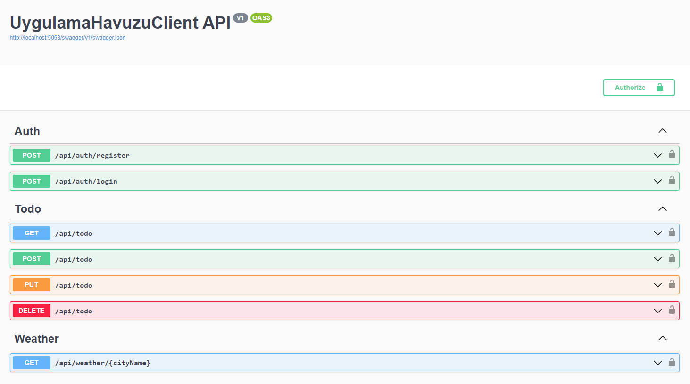

# Uygulama Havuzu Server

- Sakarya Büyükşehir Belediyesi Bilgi İşlem Dairesinde yaptığım zorunlu stajımda verilen Junior .NET Geliştirici Ödev Projesi'nin Back-End tarafını tamamlamış bulunmaktayım.

## Temel Özellikler:

- API üzerinden kullanıcı girişi ve kaydı yapılabilir.
- JWT Bearer ile kullanıcı yetkilendirme işlemleri yapılabilir.
- API üzerinden Todo App için CRUD işlemleri yapılabilir.
- OpenWeatherMap API üzerinden hava durumu bilgileri alınıp kullanıcıya gönderilebilir.

## Kurulum:

    git clone https://github.com/cusufcan/uygulama_havuzu_server

## Ekran Görüntüleri:

## Kullanılan Teknolojiler:

- C#
- ASP.NET Core 8.0
- Onion Architecture
- Dependency Injection
- Entity Framework Core
- PostgreSQL
- JWT Bearer
- Swagger
- OpenWeatherMap API

## Lisans:

    MIT
